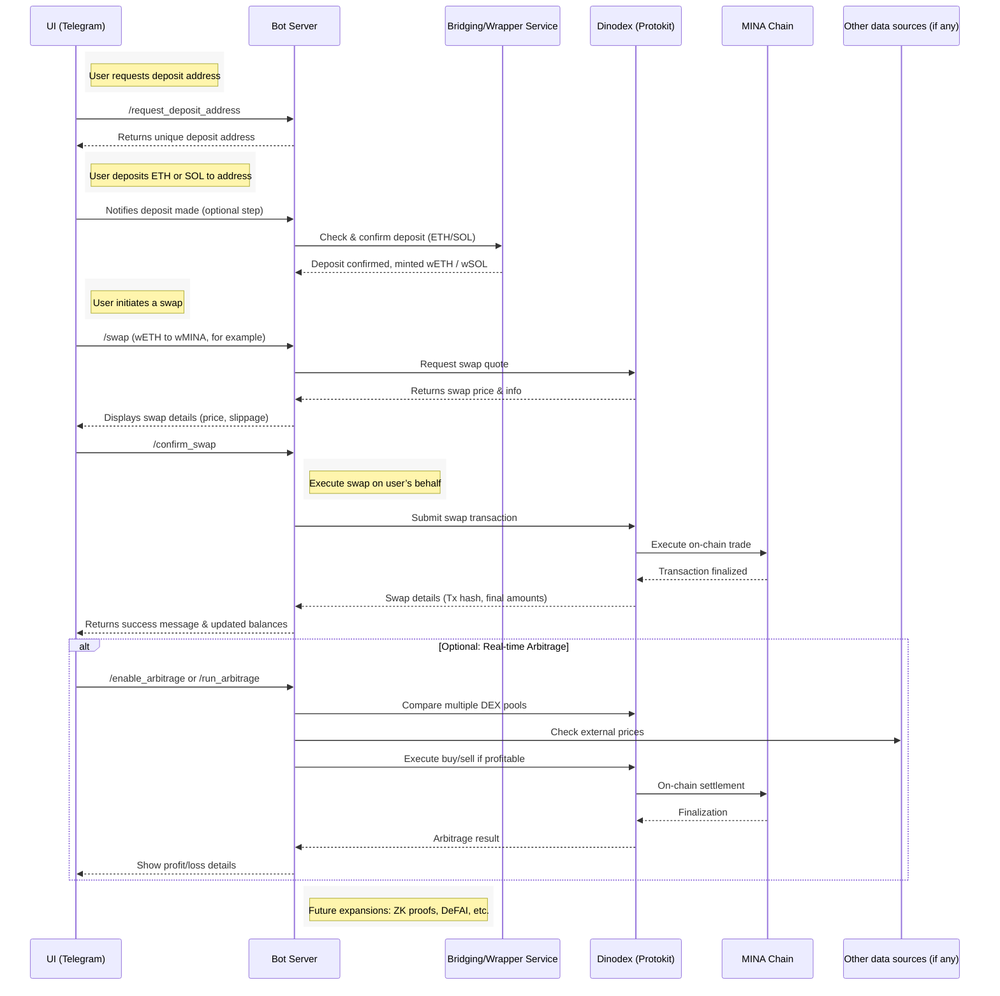

# Proposal Title: Eli (MINA Navigator Bot – Bridging DinoDEX with an Enhanced MINA Trading Experience)

## Project Background
MINA Navigator Bot: Eli is a Telegram-based DeFi tool built on the Mina Protocol, designed to streamline token swaps and real-time arbitrage. By leveraging DinoDEX’s open-source Protokit-based Swap API, users can deposit ETH or SOL into a dedicated wallet and then seamlessly convert these assets into wrapped tokens for use within the MINA ecosystem. This approach addresses the insufficient liquidity and complex onboarding found in the early stages of MINA DEX infrastructure, providing faster transactions and a simplified user experience.

Beyond basic swap functionality, MINA Navigator Bot includes a real-time arbitrage feature that monitors price differences across multiple exchanges, helping facilitate efficient price discovery and increased market volume. In the future, AI-driven trading (DeFAI) may also be considered, though the current focus is on delivering an intuitive, user-friendly tool for both newcomers and professional traders. By utilizing the Mina Protocol’s Zero-Knowledge (ZK) capabilities, MINA Navigator Bot aims to boost liquidity, accessibility, and innovation within the MINA DeFi ecosystem—catering to a wide audience, from general users to advanced investors and developers alike.

---

## Proposal Overview

### Problem
1. **Underdeveloped MINA DeFi Infrastructure**  
   o DEX activation level is low: Although multiple DEX projects are under development on the Mina Protocol, the overall DeFi infrastructure is still at an early stage. Insufficient trading volume, limited liquidity, and inadequate synergy among DEXs may lead to a skewed ecosystem and price instability.  
   o Native transaction limitations: Relying solely on the native MINA token for transactions can result in significantly slow processing times and subpar user experience. This creates a critical barrier for users interested in active trading or arbitrage.  
   o Challenge of Inclusive Growth in the MINA DeFi Ecosystem:  
   As MINA enters a pivotal phase of DeFi expansion, multiple DEX and other DeFi projects are rapidly emerging. While competition among these projects can drive innovation and overall ecosystem robustness, smaller or later-stage entrants often struggle to gain visibility and resources. This creates a fragmented environment where early players dominate, and newcomers feel sidelined.

2. **Complex user onboarding process and UX issues**  
   o Complicated cross-chain asset transfers: Users holding ETH, SOL, or other assets must navigate multiple steps to move those assets into the Mina Protocol. This increases the barrier to entry and can cause user attrition.  
   o Technical complexity and unfriendly UI: Many find it difficult to install Web3 wallets, secure seed phrases, and configure protocol-specific settings. This complexity poses a major obstacle to mainstream adoption.

3. **Lack of advanced DeFi strategies (Arbitrage, DeFAI) and automated investment**  
   o Absence of arbitrage bots: While newly emerging MINA DEXs may present price disparities (including those with external exchanges), there is no established tool to detect and exploit these differences in real time.  
   o Underutilized DeFAI: AI-driven price prediction and automated strategies (DeFi + AI) are gaining traction on various chains, but such implementations remain extremely limited in the Mina ecosystem.  
   o Reduced investment efficiency: As a result, professional traders and institutional investors have little incentive to participate, slowing down liquidity provision and broader market formation within MINA’s DeFi environment.

### Solution
1. **Underdeveloped MINA DeFi Infrastructure**  
   o DEX activation level is low: Although multiple DEX projects are under development on the Mina Protocol, the overall DeFi infrastructure is still at an early stage. Insufficient trading volume, limited liquidity, and inadequate synergy among DEXs may lead to a skewed ecosystem and price instability.  
   o Native transaction limitations: Relying solely on the native MINA token for transactions can result in significantly slow processing times and subpar user experience. This creates a critical barrier for users interested in active trading or arbitrage.

2. **Complex user onboarding process and UX issues**  
   o Complicated cross-chain asset transfers: Users holding ETH, SOL, or other assets must navigate multiple steps to move those assets into the Mina Protocol. This increases the barrier to entry and can cause user attrition.  
   o Technical complexity and unfriendly UI: Many find it difficult to install Web3 wallets, secure seed phrases, and configure protocol-specific settings. This complexity poses a major obstacle to mainstream adoption.

3. **Lack of advanced DeFi strategies (Arbitrage, DeFAI) and automated investment**  
   o Absence of arbitrage bots: While newly emerging MINA DEXs may present price disparities (including those with external exchanges), there is no established tool to detect and exploit these differences in real time.  
   o Underutilized DeFAI: AI-driven price prediction and automated strategies (DeFi + AI) are gaining traction on various chains, but such implementations remain extremely limited in the Mina ecosystem.  
   o Reduced investment efficiency: As a result, professional traders and institutional investors have little incentive to participate, slowing down liquidity provision and broader market formation within MINA’s DeFi environment.

### Impact
1. **DEX Ecosystem Activation and Liquidity Expansion**  
   o Increase in Trading Volume and Market Stability:  
     - As seen with BONKbot, it has (7d MA) around 12,000 daily users, (7d MA) 154,618 trades, and an Average Daily Volume of approximately $34,023,819. Currently, pump.fun records $3,844,056,167 in daily volume (1m MA), while BONKbot and Trojan collectively handle around $78,183,819 in daily volume (on Solana alone), which accounts for about 2–3% of the total. This figure underscores how significant a share a Telegram bot can capture. Over its lifetime, these Telegram bots represent 5–6% of pump.fun’s total Volume, reflecting substantial market influence. Leveraging this model, drawing traders’ attention and activity from the start through a Telegram bot could lead to even greater increases in volume and user engagement.  
     - An arbitrage bot narrows price discrepancies across different DEXs and boosts transaction frequency, thereby increasing trading volume and liquidity.  
     - As price formation becomes more stable, it lays the groundwork for additional projects (e.g., stablecoins, lending platforms) to establish themselves more securely.  
   o Facilitating User Influx:  
     - By enabling quick and easy transfers of widely held assets such as ETH or SOL into MINA DEXs, a broader range of users can be onboarded to the DeFi ecosystem.  
     - The low barrier to entry provided by a Telegram interface is anticipated to attract a wide pool of mainstream users.  
     - With the MINA Navigator Bot alone—covering wallet creation → asset deposits → swaps → strategic earnings—users can engage in all these steps via an intuitive chatbot format, thus contributing to both broader adoption and user-friendly participation.

2. **Advanced DeFi Strategies and Improved Market Efficiency**  
   o Expansion of Professional Trading Tools: Offers various modules for intermediate and advanced traders, including real-time price monitoring, automated trading, and AI-based backtesting.  
   o Decentralized AI (DeFAI) Challenge (Optional): By leveraging on-chain data for predictive models and autonomous trading strategies, the MINA ecosystem could evolve from simple swaps to a more sophisticated “smart trading hub.” This pursuit itself is likely to garner significant attention.

3. **Catalyst for MINA Ecosystem Development**  
   o Collaborations and Synergies in DEX and DeFi: Through cross-partnerships with DinoDEX and other projects (NFT platforms, DAOs, staking protocols, etc.), users can enjoy a richer and more diverse dApp environment.  
   o Integration of ZK: MINA Protocol’s distinctive zero-knowledge feature could be applied in areas like user authentication, asset proof, and privacy, offering a prime opportunity to showcase its potential to users.

### Audience
1. **General Users and Blockchain Beginners**  
   o Easy Accessibility: As long as they can use Telegram, users can participate in MINA DeFi without any complex wallet setup.

2. **Professional Traders and Institutional Investors**  
   o Real-time Arbitrage Opportunities: Professional traders looking to swiftly capitalize on price discrepancies to generate profits.  
   o AI-based Automated Strategies: Funds or institutions managing large amounts of capital can aim for higher returns through AI-driven DeFi strategies.

3. **Developers and MINA Ecosystem Project Teams**  
   o Open-source Collaboration: By jointly advancing the Navigator Bot’s logic and arbitrage modules, the growth of the MINA ecosystem can be accelerated.  
   o Extended Feature Development: Integrating new DEXs or NFT marketplaces allows for an expanded set of functionalities—such as in-app trading, purchasing, or voting—directly within Telegram.

---

## Architecture & Design

### Detailed Design/Architecture

**Key Participants**  
1. **UI (Telegram)**  
   o The chat interface where the user interacts via commands (/request_deposit_address, /swap, /enable_arbitrage, etc.).  
   o Displays deposit addresses, swap quotes, transaction statuses, and final results.

2. **Bot Server**  
   o Core Backend for the MINA Navigator Bot.  
   o Manages user sessions, deposit addresses, bridging logic, and actual on-chain execution via DinoDEX.  
   o Optionally coordinates real-time arbitrage operations and (in the future) DeFAI analytics.

3. **Bridging/Wrapper Service**  
   o Monitors the user’s deposited ETH/SOL, confirms receipts, and mints corresponding wrapped tokens within the MINA ecosystem.  
   o Could be an external bridging service or an in-house mechanism, depending on your architecture.

4. **DinoDEX (Protokit)**  
   o The primary DEX within the MINA ecosystem.  
   o Offers a Swap API for trading and other tokens.  
   o Facilitates on-chain swaps and returns transaction hashes or final amounts to the Bot Server.

5. **MINA Chain**  
   o Processes on-chain transactions, records final results, and ensures data integrity.  
   o Potentially leverages Mina’s ZK capabilities for future privacy-preserving or proof-based features (e.g., verifying trades without exposing exact amounts).

**Typical Flow Description**  
1. **User Requests Deposit Address**  
   o The user issues a command (/request_deposit_address) in the Telegram chat. The Bot Server generates a unique address and sends it back to the user.

2. **User Deposits ETH/SOL**  
   o The user transfers assets from their external wallet (e.g., MetaMask or Phantom) to the generated deposit address.  
   o The Bot Server checks with the Bridging/Wrapper Service to confirm the deposit. Once confirmed, corresponding wrapped tokens become available for swaps in the MINA ecosystem.

3. **Perform a Swap**  
   o The user initiates a swap by providing the source token and target token  
   o The Bot Server requests a quote from DinoDEX (Protokit). Upon receiving the quote (price, slippage, fees), it displays the information to the user.  
   o After user confirmation, the Bot Server submits the swap transaction to DinoDEX, which in turn commits it to the MINA blockchain. The Bot Server then relays the final outcome to the user.

4. **Arbitrage (Optional)**  
   o If the user opts in for arbitrage, the Bot Server monitors multiple pools or external data sources for profitable price gaps.  
   o On detecting a profitable opportunity, it executes a series of buy/sell trades via DinoDEX to capture the spread. The settlement occurs on the MINA blockchain, and the user is updated on the results.

**Vision**  
1.  **Realizing Common Goals Among MINA DeFi Projects:**  
    The MINA ecosystem is now at a crucial stage of DeFi growth. While DEX projects each strive to fulfill their own objectives, they must also foster an ecosystem that can flourish collectively. At the same time, newer DeFi projects that are slower to build often find themselves sidelined or struggling to achieve their goals. Eli aims to provide equal opportunities to all MINA DeFi users, serving as a bridge not only for established DeFi initiatives (e.g., DinoDEX, Lumina, etc.) but also for newer projects that need a platform to grow and eventually succeed.  

2.  **Ecosystem Growth:**  
As more DEXs and bridging solutions appear, the Bot Server can integrate them into its arbitrage engine or provide multi-DEX routing, making MINA Navigator Bot a comprehensive liquidity aggregator.

---

## Budget & Milestones

### Deliverables
1. **Functional MINA Navigator Bot MVP**  
   o Telegram interface  
   o Protokit-based Swap Integration  
   o Real-time Arbitrage Engine  
   o DeFAI Module (Optional)

2. **Documentation**  
   o Technical Documentation  
   o API Usage  
   o Open-source Components

3. **Testing & Maintenance Plan**  
   o Pilot User Testing & Community Feedback Cycle  
   o Hosting and Updates

### Project Timeline
1. **Phase 1: Finalize architecture & Design (1 week)**  
   o Requirements Gathering & Use Case Research  
   o Finalize system architecture & Sequence Diagram  
   o Finalize the image design for the Bot

2. **Phase 2: Starting Development & Integration (7 weeks)**  
   o Wallet & Wrapping Implementation (Wrapping service for ETH/SOL)  
   o DinoDEX (Protokit) Integration (Implement swap logic leveraging the Protokit- based Swap API)  
   o Telegram Bot UI & Backend  
   o Arbitrage Engine (Build out a module to monitor DEX pools)  
   o Arbitrage Engine (Implement automated buy/sell logic)  
   o ZK Roadmap & DeFAI Core Setup (Optional)

3. **Phase 3: Testing & Deployment (2 weeks)**  
   o Integration Testing (Devnet/Testnet)  
   o Performance & Security Audits  
   o Mainnet Deployment  
   o User Feedback & Iteration

### Budget Requested
o 24,500 MINA

### Budget Breakdown
o **Software Development:** 3 developers working 20 hours per week for 10 weeks, assuming approximately 35 MINA per hour rate (3 X 20 X 10 X 35 = 21,000).  
o **UI Design (Images):** 500 MINA  
o **Project Manager:** Aiming to actively engage in the DeFi ecosystem by directly connecting with DeFi projects and facilitating collaborative opportunities. Working 10 hours per week for 10 weeks, assuming approximately 20 MINA per hour rate (20 X 10 X 10 = 2,000).

### Wallet Address
o B62qjNJk55Amr7t3Wpju3HL66z22aPpUZKgt6ZJRccUWWPxr6vU27wx

---

## Team Info
**Proposer: Luke Nam**  
o **Github:** https://github.com/nam2ee  
o **Experience:**  https://universal-prune-200.notion.site/Luke-nam-fb6ab286b3be4a87981d38a0b678e710

**Team Member: Mingyeom Kim**  
o **Github:** https://github.com/mmingyeomm  
o **Experience:** https://www.canva.com/design/DAGV_PwmTwM/TtTU05mpQgdvLd6gSeJOcA/edit?utm_content=DAGV_PwmTwM&utm_campaign=designshare&utm_medium=link2&utm_source=sharebutton

**Team Member: Hyuntea Kwon**  
o **Github:** https://github.com/Lyeoul

---

## Risks & Mitigations

### DEX & API Dependency
1. **Risk**  
   o The bot heavily depends on DEX Swap API for liquidity and transaction execution. If Dex (like DinoDEX) experiences low liquidity, downtime, or API changes, user swaps and arbitrage may fail or produce poor results.

2. **Mitigation**  
   o Maintain close communication with DEX (DinoDEX) developers for early updates on API changes.  
   o Plan for integration with multiple DEXes as they become available on MINA to diversify liquidity sources.
